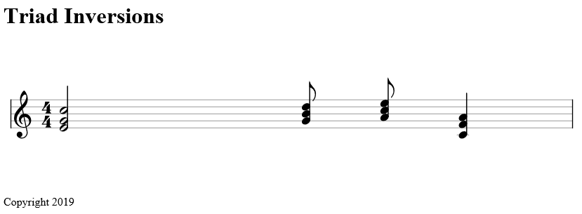
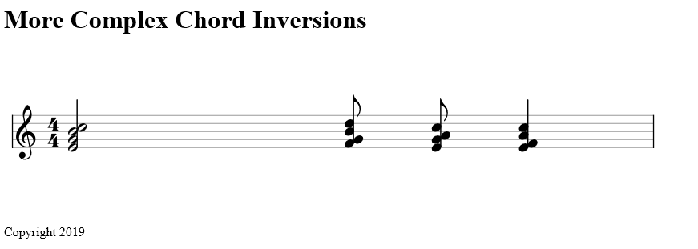
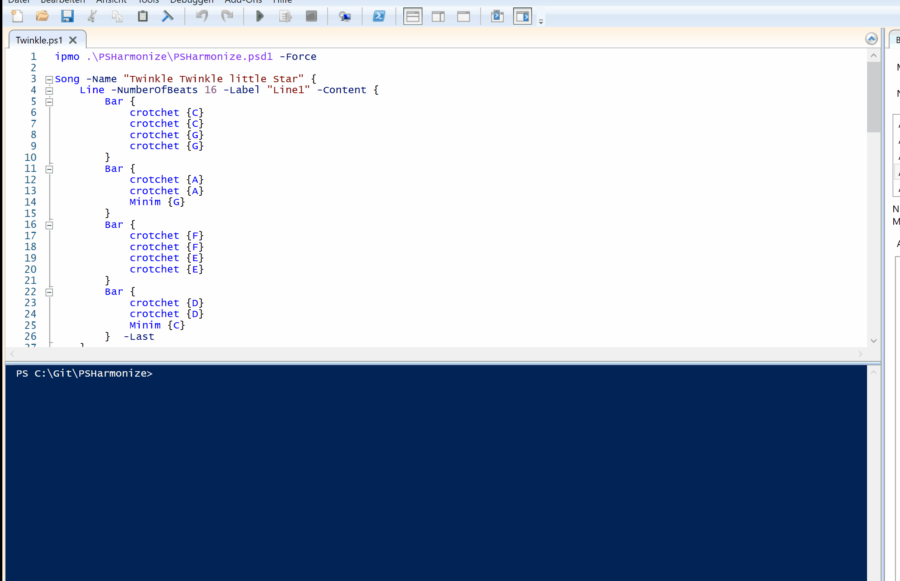

# Notation 

# First Version of DSL out!

The first version of the very basic (and maybe a little buggy) DSL is out! 

You can score Music in Powershell Syntax as follows:

```
ipmo .\PSHarmonize\PSHarmonize.psd1 -Force 

Song {
    Line -NumberOfBeats 4 -Label "Test" -Content {
         
        Bar {
            Minim {A -octave 3;C#;E} 
            quaver {C} 
            quaver {A} 
            crotchet {C;E;G} 
        } -Last
    }
    Line -NumberOfBeats 4 -Label "Test" -Content {
         
        Bar {
            Minim {A -octave 2;A -octave 3} 
            quaver {C -octave 2} 
            quaver {A -octave 2;A -octave 3} 
            crotchet {C -octave 2;E -octave 2;G -octave 2} 
        } -Last
    } -Clef baritone-f
} -OutputMode Notation -Name "One Bar with a Baseline"
```

Which will give you this:


## Add Ties to Notes

```
ipmo .\PSHarmonize\PSHarmonize.psd1 -Force 

Song {
    Line -NumberOfBeats 4 -Label "Test" -Content {
         
        Bar {
            Minim {A -octave 3;C#;E} 
            quaver {C} 
            quaver {A} 
            crotchet {C;E;G} 
        } -Last
    } -ties "0/0-1/0"
} -OutputMode Notation -Name "One Bar with ties"
```

Which will give you this:


### Score Chords

## Chords

```
ipmo .\PSHarmonize\PSHarmonize.psd1 -Force 

Song {
    Line -NumberOfBeats 4 -Label "Test" -Content {
        Bar {
            Minim {C -Chord triad} 
            quaver {G -Chord triad} 
            quaver {A -chord Dominant7 -Mood Minor} 
            crotchet {F -Chord Major7}
        } -Last
    } 
} -OutputMode Notation -Name "One Bar of Chords"
```

will give you this:


## Inversions

Simple triad Inversions:

```
ipmo .\PSHarmonize\PSHarmonize.psd1 -Force 

Song {
    Line -NumberOfBeats 4 -Label "Test" -Content {
        Bar {
            Minim {C -Chord triad -Inversion 1} 
            quaver {G -Chord triad} 
            quaver {A -chord Triad -Mood Minor} 
            crotchet {F -Chord Triad -Inversion 2}
        } -Last
    } 
} -OutputMode Notation -Name "Triad Inversions"
```



More complex Chords with Inversions:

```
ipmo .\PSHarmonize\PSHarmonize.psd1 -Force 

Song {
    Line -NumberOfBeats 4 -Label "Test" -Content {
        Bar {
            Minim {C -Chord Major7 -Inversion 1} 
            quaver {G -Chord Dominant7 -Inversion 3} 
            quaver {A -chord Dominant7 -Mood Minor -Inversion 2} 
            crotchet {F -Chord Major7 -Inversion 3}
        } -Last
    }  
} -OutputMode Notation -Name "More Complex Chord Inversions" 
```



## Gif or didn't happen:

Make the Stars twinkle with The Following Code:

[Twinkle twinkle little star](../Examples_Notation/Twinkle.ps1)

