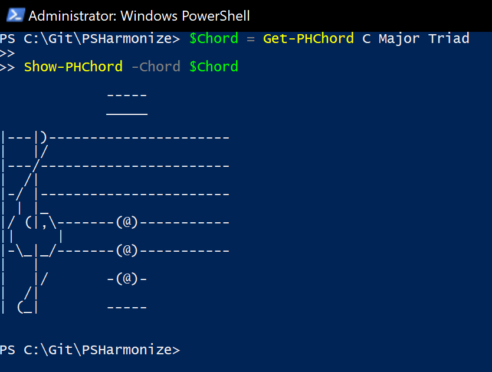
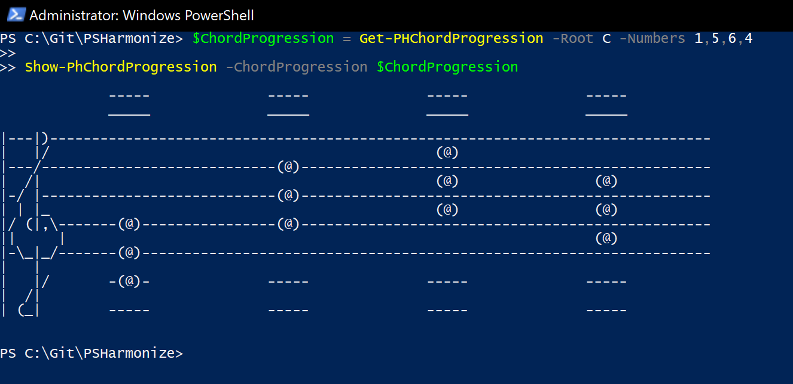
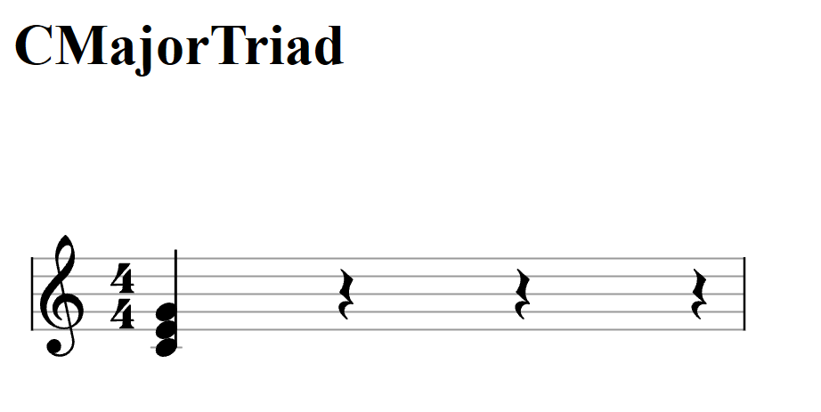
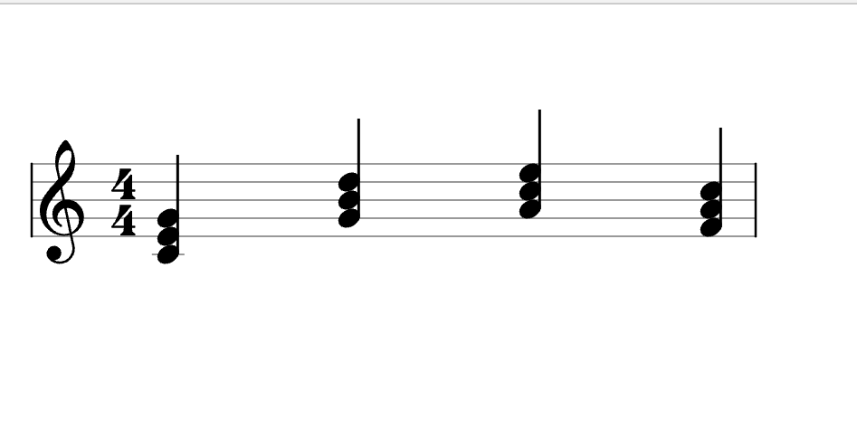

# PSHarmonize
Powershell Music framework

## Create Music without musical knowledge

PSHarmonize let's you create Music without you having to know Musictheory or how to play an instrument.

How can it do that, you ask? It knows Music theory *for* you! 

# Roadmap

[X] basic Scales
[X] basic Chords
[X] ChordProgressions
[X] Basic Console Output Sheet Music
[X] Actualy Basic Sheet Music
[ ] More Complex Scales
[ ] More Complex Chords
[ ] Actual harmonizing of melodies
[ ] DSL for sheet music
[ ] Possibility to output Midi from DSL
  
# Detailed Introduction

## Intro

In Music we usually define a 'key' to which we relate what we play. A key is defined by its root note.

So for example if we take the key of 'C' we have 'C' as our root note. Now how would do we know what other 
notes we can use in the key of 'C'? So this is where music theory comes in and you would go ahead and apply 
intervals (difference between notes in numbers --> 1 above 'C' would be 'D') up until we are at the root note
again, but one octave higher. One octave would be 12 semi tones higher than the root note. So in the case of 
'C' it is a C again, but played higher.

**Confused yet? Good! Cause that's what PSHarmonize is for!**

## Scales

So all the notes that relate to the key of 'C' together form a Scale. There are many different types of scales.
For the basics we will just stick to the major scale, which is the one that you are probably most familiar with. 

Ok let's get in to what PSHarmonize does. You can for example use the following command to output the notes of a 
specific scale:

```
Get-PHScale -Root C -Mood Major
```

Which would return you an object filled with Notes:

```
Root Notes                        Mood Numerals
---- -----                        ---- --------
Note {Note, Note, Note, Note...} Major
```

Now to check what notes the scale actually contains you can access that object like this:

```
(Get-PHScale -Root C -Mood Major).Notes.letter
```

Which would then return you this:

```
C
D
E
F
G
A
B
C
```
You can do that for the Scale of every Note! It also works for Minor scales.

## Harmony

So now you have an easy way to check what notes are in a scale. But we wanna get in to the fun stuff! nobody wants to 
practice scales for hours and hours. You want to play a piece as a whole, or accompany someone else singing for example.

You do this by taking the melody of a song (A Melody is just a sequence of notes) and harmonizing it. So what is harmony?
Harmony is the combination of notes (play them at the same time). 

So another thing I have to learn i hear you ask. No! PSHarmonize can show you chords aswell as it can show you scales!

## Chords

So the combination of multiple notes are called a Chord. You get a variety of them again to keep it simple we will stick
to triads for the demo here. A triad would be a Chord built out of 3 notes. The root note, the terz and the quint. So in Intervals that would be 1,3,5. 

But again, I'm gonna stop boring you here and show you how you can get a chord with PSHarmonize:

```
Get-PHChord -Root C -Mood Major -Type Triad
```

Will get you:

```
Root      : Note
Notes     : {Note, Note, Note}
Type      : Triad
Mood      : Major
ChordName : CMajorTriad
```

Again to access the notes of the Chord use:

```
(Get-PHChord -Root C -Mood Major -Type Triad).Notes.letter
```

Which will give you this:

```
C
E
G
```

## Chord Progressions

A Chord Progression is a progression of Chord (duh). PSHarmonize offers you a cmdlet that let's you generate chord 
progressions that actually make sense. 

So here we get in to theory again. In a key you define all the 7 notes in the key with a number from 1-7 
according on what note comes after the other. So in 'C' the number 3 would be 'E' for example. Now depending on
which stage of the key you are you play chords with different characters. This especially applies to Pop music.

Again tho, you don't have to know this. PSHarmonize does it for you:

```
Get-PHChordProgression -Root C -Numbers 1,5,6,4
```

Check out what Chords are given back to you:

```
CMajorTriad
GMajorTriad
AMinorTriad
FMajorTriad
```

## Sheet Music

So now you know how you can generate Scales and Chords using PSHarmonize. Another feature this Module offers is Notation!

If you are playing music or you have a friend who does you don't wanna look at a Powershell console and see:

```
C
E
G
```

So we are talking about sheet music now. Sheet music is music in a written form. You can imagine it as an own language that you can write on paper and then express singing or by playing instruments. 

So here's how you can generate sheet music in your Powershell Console.

### Console Output

You use a Chord generated using the command from above to output it to the Console:

```
$Chord = Get-PHChord C Major Triad

Show-PHChord -Chord $Chord
```

Now this will output you the following:



You can aswell output whole Chord Progressions:

```
$ChordProgression = Get-PHChordProgression -Root C -Numbers 1,5,6,4

Show-PhChordProgression -ChordProgression $ChordProgression
```

Which will output this:



How awesome is that, right? :)

### Actual Sheet Music

Now the console output is cool, but a musician normally does not read his music from a Powershell console.
He does it from actual sheet music. PSHarmonize can provide that aswell. 

Note that a requirement for this feature is the Powershell Module PSHTML. You hust have to have it installed.

So here's how you do it. You take a Chord, just like with the console output, and you add HTML at the cmdlet:

```
$Chord = Get-PHChord C Major Triad

Show-PHChordHTML -Chord $Chord
```

Will give you this:




You can aswell do it with a ChordProgression:

```
$ChordProgression = Get-PHChordProgression -Root C -Numbers 1,5,6,4

Show-PhChordProgression -ChordProgression $ChordProgression
```

Will give you this:

