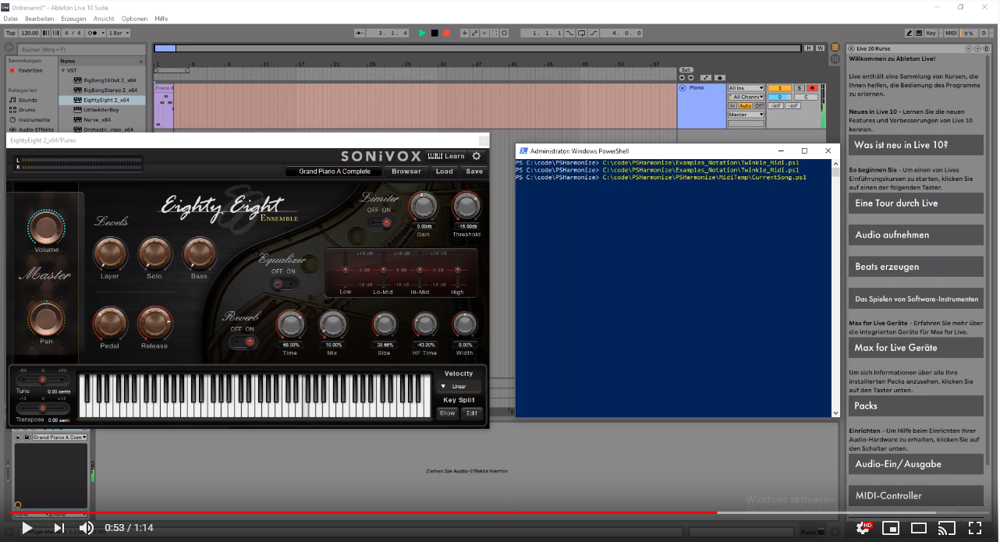
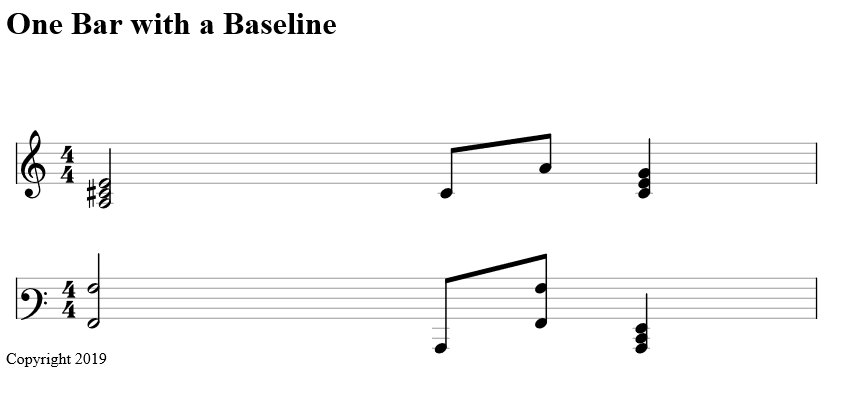

# PSHarmonize
Powershell Music framework

## Create Music without musical knowledge

PSHarmonize let's you create Music without you having to know Musictheory or how to play an instrument.

How can it do that, you ask? It knows Music theory *for* you! 

## AzurePipelines

| Overall Status | Windows | Linux | MacOS | 
|---|---|---|---|
| [](https://bateskevin.visualstudio.com/PSHarmonize/_build/latest?definitionId=1&branchName=master) | [](https://bateskevin.visualstudio.com/PSHarmonize/_build/latest?definitionId=1&branchName=master) | [](https://bateskevin.visualstudio.com/PSHarmonize/_build/latest?definitionId=1&branchName=master) | [](https://bateskevin.visualstudio.com/PSHarmonize/_build/latest?definitionId=1&branchName=master) | [](https://bateskevin.visualstudio.com/PSHarmonize/_build/latest?definitionId=1&branchName=master)|

# Roadmap

- [X] basic Scales
- [X] basic Chords
- [X] ChordProgressions
- [X] Basic Console Output Sheet Music
- [X] Actualy Basic Sheet Music
- [X] Basic Midi Output
- [ ] DSL
    - [X] Create Basics for writing Sheet Music
    - [X] Add way to notate Chords directly
    - [X] Add way to notate inversions of chords directly
    - [X] Add Support for accidetals
    - [X] Add Bassline Notation
    - [X] Add ties in notation
    - [ ] Add Key Definition of Song
    - [ ] Add functionality to export the notated music to a Midi Script
        - [X] Basic Midi Support now Works!!! :D 
- [ ] More Complex Scales
- [ ] More Complex Chords
- [ ] Actual harmonizing of melodies
- [ ] Possibility to output Midi from DSL

## Intro

In Music we usually define a 'key' to which we relate what we play. A key is defined by its root note.

So for example if we take the key of 'C' we have 'C' as our root note. Now how would do we know what other 
notes we can use in the key of 'C'? So this is where music theory comes in and you would go ahead and apply 
intervals (difference between notes in numbers --> 1 above 'C' would be 'D') up until we are at the root note
again, but one octave higher. One octave would be 12 semi tones higher than the root note. So in the case of 
'C' it is a C again, but played higher.

**Confused yet? Good! Cause that's what PSHarmonize is for!**

To learn more about the basics and understand better how PSHarmonize can help you go [here](Docs/Basic Theory.md)


# Midi 

You can Output your notated music to Midi. Check out [this Video](https://www.youtube.com/watch?v=xQJravil4eU&feature=youtu.be)



**Read More about Midi** [here](Docs/Midi.md) (Docs not done yet)

# Notation

The first version of the very basic (and maybe a little buggy) DSL is out! 

You can score Music in Powershell Syntax as follows:

```
ipmo .\PSHarmonize\PSHarmonize.psd1 -Force 

Song {
    Line -NumberOfBeats 4 -Label "Test" -Content {
         
        Bar {
            Minim {A -octave 3;C#;E} 
            quaver {C} 
            quaver {A} 
            crotchet {C;E;G} 
        } -Last
    }
    Line -NumberOfBeats 4 -Label "Test" -Content {
         
        Bar {
            Minim {A -octave 2;A -octave 3} 
            quaver {C -octave 2} 
            quaver {A -octave 2;A -octave 3} 
            crotchet {C -octave 2;E -octave 2;G -octave 2} 
        } -Last
    } -Clef baritone-f
} -OutputMode Notation -Name "One Bar with a Baseline"
```

Which will give you this:



**Read More about Notation [here](Docs/Notation.md)**  